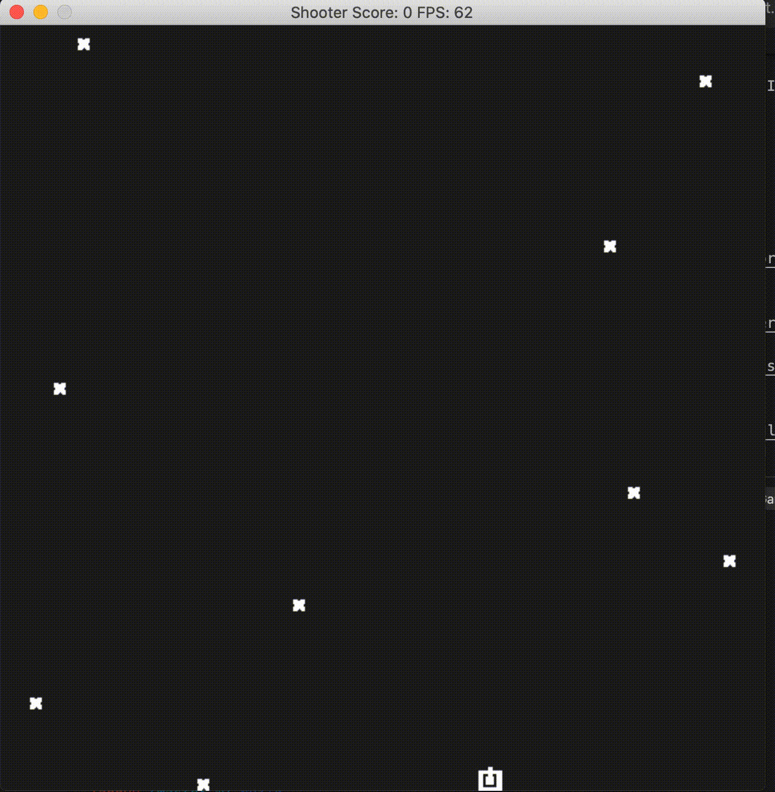

# Pong Game

This is a simple shooter game developped in C++ as the Capstone project in the [Udacity C++ Nanodegree Program](https://www.udacity.com/course/c-plus-plus-nanodegree--nd213). 

Move tank with "left" and "right" key, and shoot the spaceship (marked as "X") with "space" key to score. Currently there is no effect when tank gets hit by the spaceship, which can be improved in the future.

The code is structured as follows:
In `main.cpp`, the `main` function is located, and calls `Game::run()` function running as an infinite loop. `Game` class holds three variables: `tank` (as an instance object of `Tank` class),  `bullet_container` (as a shared_ptr of `BulletContainer` class) and `spaceship_container` (as a unique_ptr of `SpaceshipContainer` class).  Both `BulletContainer` and `SpaceshipContainer` class inherit from `MovingObjectContainer` class, and maintain *bullets* and *spaceships* respectively as a vector of `MovingObject` inside. `tank` generates `MovingObject` (as bullets) and store it inside `bullet_container`. `spaceship_container` runs in a separate thread which generates `MovingObject` (as spaceships) at random position and with random period. In `Game::Update()` function, we check collisions between bullets and spaceships, and update scores accordingly. Invalid bullets and spaceships (either moving out of the visualisation window or having a collision) are removed from the vector thus get destroyed. 
This project satisfies the necessary rubic:
1. Loops, Functions, I/O
	- The project demonstrates an understanding of C++ functions and control structures.
	- The project reads data from a file and process the data, or the program writes data to a file.
	- The project accepts user input and processes the input.
2. Object Oriented Programming
	- The project uses Object Oriented Programming techniques.
	- Classes use appropriate access specifiers for class members.
	- Class constructors utilize member initialization lists.
	- Classes abstract implementation details from their interfaces.
	- Classes encapsulate behavior.
	- Classes follow an appropriate inheritance hierarchy.
3. Memory Management
	- The project makes use of references in function declarations.
	- The project uses destructors appropriately.
	- The project uses scope / Resource Acquisition Is Initialization (RAII) where appropriate.
	- The project uses smart pointers instead of raw pointers.
4. Concurrency
	- The project uses multithreading.
	- A mutex or lock is used in the project.

## Dependencies for Running Locally
* cmake >= 3.7
  * All OSes: [click here for installation instructions](https://cmake.org/install/)
* make >= 4.1 (Linux, Mac), 3.81 (Windows)
  * Linux: make is installed by default on most Linux distros
  * Mac: [install Xcode command line tools to get make](https://developer.apple.com/xcode/features/)
  * Windows: [Click here for installation instructions](http://gnuwin32.sourceforge.net/packages/make.htm)
* SDL2 >= 2.0
  * All installation instructions can be found [here](https://wiki.libsdl.org/Installation)
  * Note that for Linux, an `apt` or `apt-get` installation is preferred to building from source.
* SDL_image >= 2.0
  * All information can be found [here](https://www.libsdl.org/projects/SDL_image/)
* gcc/g++ >= 5.4
  * Linux: gcc / g++ is installed by default on most Linux distros
  * Mac: same deal as make - [install Xcode command line tools](https://developer.apple.com/xcode/features/)
  * Windows: recommend using [MinGW](http://www.mingw.org/)

## Basic Build Instructions

1. Clone this repo.
2. Make a build directory in the top level directory: `mkdir build && cd build`
3. Compile: `cmake .. && make`
4. Run it: `./ShooterGame`.